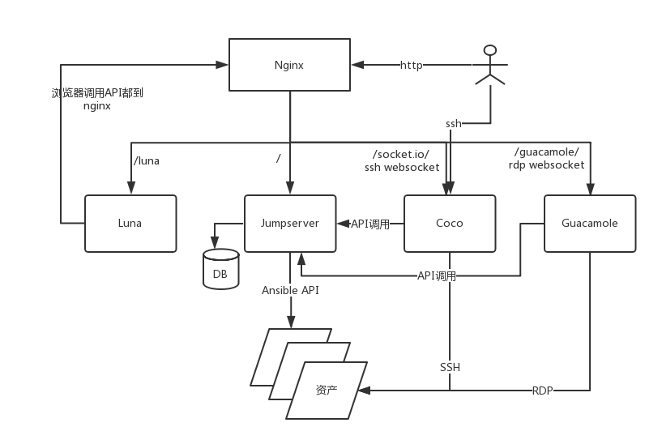

架构说明
=================




组件说明
=================

glance
`````````````
现指 glance 管理后台，是核心组件（Core）, 使用 Django Class Based View 风格开发，支持 Restful API。

`Github <https://github.com/glance/glance.git>`_


Coco
````````
实现了 SSH Server 和 Web Terminal Server 的组件，提供 SSH 和 WebSocket 接口, 使用 Paramiko 和 Flask 开发。


`Github <https://github.com/glance/coco.git>`__


Luna
````````
现在是 Web Terminal 前端，计划前端页面都由该项目提供，glance 只提供 API，不再负责后台渲染html等。

`Github <https://github.com/glance/luna.git>`__


Guacamole
```````````
Apache 跳板机项目，glance 使用其组件实现 RDP 功能，glance 并没有修改其代码而是添加了额外的插件，支持 glance 调用。


glance-Python-SDK
```````````````````````
glance API Python SDK，Coco 目前使用该 SDK 与 glance API 交互。

`Github <https://github.com/glance/glance-python-sdk.git>`__


